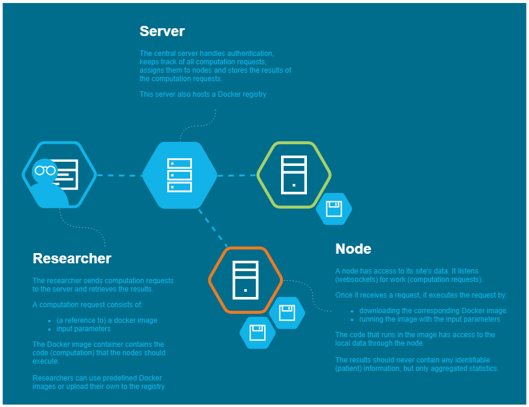

# Welcome!

* Are you are researcher? Start [here](reseachers/your-first-computation-task.md)!
* Are you a data-provider? Start [here](setup/install-vantage6.md)!
* Do you want to host a VANTAGE6 server? Start [here](setup/install-vantage6.md)!


\*\*\*\*⛑ **Need Support?**  
Please join us on our [Discord channel](https://discord.gg/yAyFf6Y)!

👩💻 **Found a Bug?**  
Please report it at our ****[**github**](https://github.com/iknl/vantage6) ****page! ****


## ⛩ Introduction

The growing complexity of cancer diagnosis and treatment requires data sets that are larger than currently available in a single hospital or even in cancer registries. However, sharing patient data is difficult due to patient privacy and data protection needs. Privacy preserving federated learning technology has the potential to overcome these limitations.

The general idea behind federated learning is that sites share a \(statistical\) model and model parameters instead of sharing sensitive data: each site runs computations on a local data store that generate these aggregated statistics. In this setting organizations can collaborate by exchanging aggregated data/statistics while keeping the underlying data safely on site and undisclosed.

## 🛤 The Infrastructure

Collaboration through distributed learning requires an infrastructure. The open source software [VANTAGE6](https://github.com/IKNL/vantage6) provides this infrastructure. Conceptually, it consists of the following parts:

1. A **central server** that coordinates communication with the nodes;
2. One or more **nodes** that execute algorithms \(encapsulated in Docker images\) and return the output;
3. **Organisations** that are interested in collaborating with each other;
4. **Collaborations** between organisations;
5. **Users** \(i.e. researchers\) that instruct the nodes which algorithms to execute and the parameters to use;
6. A **Docker registry** that functions as a database of algorithms.

