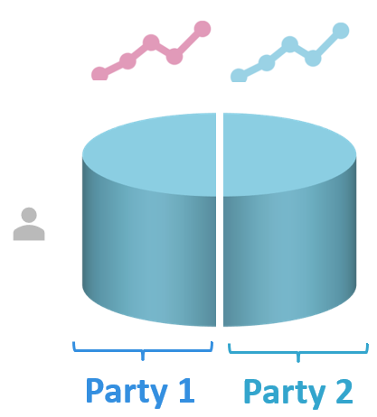

# Creating a New \(Complex\) Algorithm

In the [previous section](create-new-algorithm.md), we saw how to create a simple algorithm in the Vantage. However,it only explains the essence. Algorithms trend to be more complex. In this section, we will explain the steps to create a more complicated algorithm, which includes an iterative process \(e.g., `for` loop\) between the central server and the nodes, in Python.

## Scenario

For this example, we will consider the scenario in which we wish to analyse vertically-partitioned data from two different parties \(Fig. 1\). Namely, we want to obtain a regression model's $$\beta$$ coefficients. However, adapting the steps presented here for the horizontally-partitioned case is straightforward.



**Fig. 1**. Vertically-partitioned data. In this case, parties have different features from the same instances \(i.e., patients\).

## Assumptions

We will assume the following:

1. It is possible to mathematically decompose the algorithm in a distributed fashion.
2. Data across parties is aligned \(i.e., patient 1 is in row 1 of all data partitions, patient 2 is in row 2 of all data partitions, and so on\). This assumption is crucial for vertically-partitioned data.
3. Data have been pre-processed appropriately \(i.e., data are clean and column names match\).

## Standardizing IO

The algorithm will receive input parameters in a txt file. Furthermore, it will write the output to a txt file too. Both of these files will be located in the `/app/` directory \(i.e., `/app/input.txt` and `app/output.txt`. In order to keep maximum flexibility, JSON format must also be used as input/output format for all functions. 


When passing strings in a JSON, use double quotes \(`"string"` \) and _not_ single quotes \(`'string'`\) since the latter are not JSON compliant.



You cannot send `numpy` arrays in JSON. Thus, when you need to send one, be sure to:

1. Convert it to a list \(e.g., `numpy_array.tolist()`\)
2. Pack it into the JSON
3. Send it to a function
4. Receive it in the function
5. Convert it back to a numpy array \(e.g., `np.array(a_list)`\)

Take[ algorithm\_nodes](creating-a-new-complex-algorithm.md#algorithm_nodes-py) as an example.



The txt-files are likely to be replaced by a more robust system in the future. 


###  Environment variables

The following environment variables need to be available to the algorithm:

<table>
  <thead>
    <tr>
      <th style="text-align:left">Variable name</th>
      <th style="text-align:left">Description</th>
    </tr>
  </thead>
  <tbody>
    <tr>
      <td style="text-align:left"><code>DATABASE_URI</code>
      </td>
      <td style="text-align:left">
        <p>Path to the data file (e.g., csv file).</p>
        <p>Of course, this path will change for each party (i.e., node).</p>
      </td>
    </tr>
    <tr>
      <td style="text-align:left"><code>HOST</code>
      </td>
      <td style="text-align:left">Host name and protocol (http/https) of the central server</td>
    </tr>
    <tr>
      <td style="text-align:left"><code>API_PATH</code>
      </td>
      <td style="text-align:left">Api path of the central server</td>
    </tr>
    <tr>
      <td style="text-align:left"><code>PORT</code>
      </td>
      <td style="text-align:left">Port to which the central server listens</td>
    </tr>
  </tbody>
</table>


From version 0.3.0 the same environment variables will be used, however the `host`, `api_path`and `port` point towards a local proxy server as the algorithm container no longer has internet access.


## The algorithm

We will need to create at least four different files \(of course, in your case you could have more \[supporting\] files\):

1. `main.py`
2. `master.py`
3. `algorithm_central.py`
4. `algorithm_nodes.py`
5. `Dockerfile`
6. `requirements.txt`

Let's go in detail through each of these: what they are supposed to do and how are they supposed to be structured.

### main.py

This file is the main entry-point for the Docker container. Furthermore, it will also trigger the [execution of the algorithm in the Docker container](creating-a-new-complex-algorithm.md#dockerizing-the-algorithm). Let's look at it in detail.


You can think of a _Docker image_ as a template/blueprint.   
You can think of a _Docker container_ as an instance of such template.


First, some standard imports

```python
import sys
import json
```

Then, we need to import the functions that will be triggered in the master container and in the nodes. 

```python
# Central server
from master import master

# Nodes
from algorithm_nodes import(
    count_patients,
    compute_conjugate_matrix,
    update_beta 
)
```

Notice that although there are more functions that are _called_ in the master container, these are all called by the `master` function, which is the one that is _triggered_. A master container is an instance of a _docker image_ which triggers the master function. 

For convenience, we will also quickly define a couple of functions to display information to the console and to store in the log-file. These functions are particularly useful when debugging your code:

```python
info = lambda msg: sys.stdout.write("info > " + msg + "\n")
warn = lambda msg: sys.stdout.write("warn > " + msg + "\n")
```

Afterwards, we will read the input to the algorithm from the file `input.txt` \(as [defined previously](creating-a-new-complex-algorithm.md#standardizing-io)\):

```python
info("Reading input...")
with open("app/input.txt") as fp:
    input_ = json.loads(fp.read())
```

In the next step, we need to define which function will be triggered. When the user makes a request to run the algorithm, it will trigger the `master` function. When the algorithm is running, it will trigger the corresponding node functions. This looks as follows:

```python
method_name = input_.get("method", "master")
method = {
    "master": master,
    "count_patients": count_patients,
    "compute_gram_matrix": compute_conjugate_matrix,
    "update_beta": update_beta
}.get(method_name, None)

# if no method was found, end execution
if not method:
    warn(f"Method '{method_name}' not found!\n")
    exit()

# read method's arguments
args = input_.get("args", [])
kwargs = input_.get("kwargs", {})
```


The convention for defining the keys in the `method` dictionary is using [snake case](https://en.wikipedia.org/wiki/Snake_case) \(i.e.,  `lowercase_separated_by_underscores`\). Please avoid any other casing!


Then, we will actually call the function. Notice how the prototype for all functions is the same \(`method(*args, **kwargs)`\), except for the `master` function, which requires a `token` as an input too.

```python
if method_name == "master":
    info("Reading token...")
    with open("app/token.txt") as fp:
        token = fp.read().strip()
        info(token)    
    output = method(token, *args, **kwargs)
    
else: 
    output = method(*args, **kwargs)
```

Finally, we will write the output as a txt-file:

```python
info("Writing output...")
with open("app/output.txt", 'w') as fp:
    fp.write(json.dumps(output))
```

### master.py

This file will do the heavy lifting. It will coordinate the flow of the algorithm between the central server and the nodes as a researcher would do. Let's look at it a little bit closer.

First, the imports:

```python
import sys
import os
import json
import time

import algorithm_central
from pytaskmanager.node.FlaskIO import ClientContainerProtocol
```


For now don't worry about `pytaskmanager.node.FlaskIO`. It will be installed in the Docker container later on. The import `pytaskmanager` will change in version 0.3.0.


Then, we will define the parameters of the algorithm execution:

```python
ITERATIONS = 10 # Max number of iterations waiting for convergence. 
TOLERANCE = 1e-8 # Tolerance limit for convergence.
```

Just like in `main.py`, we will define a couple of functions for printing in the console.

```python
info = lambda msg: sys.stdout.write("info > " + msg + "\n")
warn = lambda msg: sys.stdout.write("warn > " + msg + "\n")
```

Afterwards, we will define a `master` function, which will contain the workflow of the algorithm. Its prototype will be `master(token, organization1_id, organization2_id)` , which can be extended to as many organizations \(i.e., parties, nodes\) as necessary. In this case, for the sake of simplicity we will only consider two.

Inside `master`, the first thing is to set up the connection client. We can do so like this:

```python
client = ClientContainerProtocol(
    token = token, 
    host = os.environ["HOST"],
    port = os.environ["PORT"], 
    path = os.environ["API_PATH"]
)
```

For convenience, we will define the names of the columns of interest of each party \(node\).

```python
columns1 = ['feat1', 'feat2', 'feat3']
columns2 = ['featA', 'featB', 'featC']
n_features = len(columns1 + columns2)
```


In the code-block above the column-names are hard coded. This is not ideal, as now you have to rebuild the entire image if different column-names are used. A better solution would be to supply these as input to the master method. 


Suppose that our algorithm requires counting the number of patients at each node. After that, we need to compute the conjugate of the feature matrix at each node, too. _Every time that we want to execute a function in a node, we need to create a task and wait for its results_. This would result in the following code:

```python
info("Computing number of patients...")
patients_tasks = []
for [columns, organization_id] in zip([columns1, columns2], [organization1_id, organization2_id]):
    new_task = client.create_new_task(
            input_ = {
                    "method": "count_patients",
                    "args": [columns],
                    "kwargs": {}
            },
            organization_ids = [organization_id]
            )
    patients_tasks.append(new_task)

info("Waiting for number of patients count...")
patients1 = wait_for_results(client, patients_tasks[0])
patients2 = wait_for_results(client, patients_tasks[1])


info("Computing conjugate matrices...")
conjugate_tasks = []
for [columns, organization_id] in zip([columns1, columns2], [organization1_id, organization2_id]):
    new_task = client.create_new_task(
            input_ = {
                    "method": "compute_conjugate_matrix",
                    "args": [columns],
                    "kwargs": {}
            },
            organization_ids = [organization_id]
            )
    conjugate_tasks.append(new_task)

info("Waiting for local gram matrices computation...")
conjugate1= wait_for_results(client, conjugate_tasks[0])
conjugate2 = wait_for_results(client, conjugate_tasks[1])
```

The function `wait_for_results` is defined outside `master` and looks like this:

```python
def wait_for_results(client, task):

    task_id = task.get("id")
    task = client.request(f"task/{task_id}")
    while not task.get("complete"):
        task = client.request(f"task/{task_id}")
        info("Waiting for results...")
        time.sleep(1)

    info("Obtaining results...")
    results = client.get_results(task_id = task.get("id"))
    results = [json.loads(result.get("result")) for result in results]
    if len(results) == 1:
        results = results.pop()
    return results

```

It is worth mentioning something important here. The way the code is now, we would first ask for the number of patients, wait for the results, ask for the conjugate matrices, and wait for the results. However, these two processes are independent of each other. In other words, we don't need the number of patients to compute the conjugate matrices. Therefore, we can improve the performance of our code by doing a little bit of reshuffling:

```python
info("Computing number of patients...")
patients_tasks = []
for [columns, organization_id] in zip([columns1, columns2], [organization1_id, organization2_id]):
    new_task = client.create_new_task(
            input_ = {
                    "method": "count_patients",
                    "args": [columns],
                    "kwargs": {}
                    },
            organization_ids = [organization_id]
            )
    patients_tasks.append(new_task)   

info("Computing conjugate matrices...")
conjugate_tasks = []
for [columns, organization_id] in zip([columns1, columns2], [organization1_id, organization2_id]):
    new_task = client.create_new_task(
            input_ = {
                    "method": "compute_conjugate_matrix",
                    "args": [columns],
                    "kwargs": {}
                    },
            organization_ids = [organization_id]
            )
    conjugate_tasks.append(new_task)


info("Waiting for number of patients count...")
patients1 = wait_for_results(client, patients_tasks[0])
patients2 = wait_for_results(client, patients_tasks[1])

info("Waiting for local gram matrices computation...")
conjugate1= wait_for_results(client, conjugate_tasks[0])
conjugate2 = wait_for_results(client, conjugate_tasks[1])
```


When implementing your algorithm, keep in mind which steps need to be done sequentially and which steps can be done in parallel and order your code accordingly.


Now, let's suppose that our algorithm needs to obtain the sum of the conjugate matrices. This operation is done in the master container as follows:

```python
info("Computing global conjugate matrix...")
K = algorithm_central.compute_global_conjugate_matrix([
    conjugate1,
    conjugate2 
])['K']
```

Finally, let's suppose that the algorithm will make an initial guess of the $$\beta$$ coefficients and will update this value iteratively depending on the global conjugate matrix and the data of at each node. It will stop updating after a certain number of iterations has been reached \(defined earlier as `ITERATIONS`\) or when the change between the coefficients is less than `TOLERANCE` \(i.e., when $$\beta$$ coefficients have converged\). We can do this using the following code:

```python
info(f"Preparing {ITERATIONS} iterations...")
coefficients = {} # Initialize variables.
coefficients['beta_init'] = 0.5 * np.ones((n_features , 1)) # Initial guess.

info(f"Computing betas...")   
for s in range(0, ITERATIONS):

    info(f"Iteration {s}")
    if s == 0:
        beta_old = coefficients['beta_init'] 
    else:
        beta_old = beta

    info("Computing local beta...")
    beta_tasks = []
    for [columns, organization_id] in zip([columns1, columns2], [organization1_id, organization2_id]):
        new_task = client.create_new_task(
                input_ = {
                        "method": "update_beta",
                        "args": [
                                columns,
                                K,
                                beta_old.tolist()
                                ],
                        "kwargs": {}
                        },
                organization_ids = [organization_id]
                )
        beta_tasks.append(new_task)
    
    info("Waiting for local E matrices computation...")
    beta1 = wait_for_results(client, beta_tasks[0])
    beta2 = wait_for_results(client, beta_tasks[1])

    beta = beta1 + beta2
    
    # Check for convergence
    if max(abs(beta - beta_old)) < TOLERANCE:
        info(f"Convergence reached at iteration {s}")
        break

# Final alpha value.
coefficients['beta_final'] = beta
```

### algorithm\_central.py

In this file, we will define the \(mathematical\) functions that will be executed _by the master container_. For our example, this file would look something like this.

We will start with the same basics as before: imports and a couple of functions for printing to the console.

```python
import sys
import numpy as np

info = lambda msg: sys.stdout.write("info > " + msg + "\n")
warn = lambda msg: sys.stdout.write("warn > " + msg + "\n")
```

Afterwards, we will define all the actual functions. In our example, this was the function `compute_global_conjugate_matrix`

```python
def compute_global_conjugate_matrix(nodes_conjugate_matrix):
    # Initialize global conjugate matrix.
    K = np.zeros(np.array(nodes_conjugate_matrix[0]['K']).shape)
    
    # Add nodes' gram matrices.
    for node_conjugate_matrix in nodes_conjugate_matrix:
        K += node_conjugate_matrix ['K']
    
    return {'K': K.tolist()}
```

### algorithm\_nodes.py

In this file, we will define the \(mathematical\) functions that will be executed _by the nodes_. For our example, this file would look something like this.

We will start with the same basics as before: imports and a couple of functions for printing to the console.

```python
import sys
import os
import pandas as pd
import numpy as np

info = lambda msg: sys.stdout.write("info > " + msg + "\n")
warn = lambda msg: sys.stdout.write("warn > " + msg + "\n")
```

Afterwards, we will define all the actual functions. In our example, these were the functions `count_patients`, `compute_conjugate_matrix`, and `update_beta` 

```python
def count_patients(column_names):

    # Read data.
    path = os.environ["DATABASE_URI"]
    X = pd.read_csv(path)[column_names].to_numpy()
    
    # Compute number of patients.
    M = len(X)
    
    return {'M': M}
```

```python
def compute_conjugate_matrix(column_names):
   
    # Read data.
    path = os.environ["DATABASE_URI"]
    X = pd.read_csv(path)[column_names].to_numpy()
    
    # Compute conjugate matrix
    K = np.conjugate(X).tolist()
    
    return {'K': K}
```

```python
def update_beta(columns, K, beta_old):

    # Read data.
    path = os.environ["DATABASE_URI"]
    data = pd.read_csv(path)[columns].to_numpy()
    
    # Convert from list to 
    beta_old = np.asarray(beta_old)
    
    # Compute new value of beta as a function of data, K, and old beta.    
    beta_new = ...

    return beta_new.tolist()
```

## Dockerizing the algorithm

Finally, [just like in the previous example](create-new-algorithm.md#dockerize-distributed-algorithm), we will dockerize the algorithm and push it to a registry from which the nodes can retrieve the algorithms. To do so, we need to generate a `requirements.txt` where we specify which packages are needed:


```text
pandas
numpy
ppdli
```


Then, we will generate a `Dockerfile`, which dictates the how the Docker image is build.


```text
# Choose Python 3 image as base.
FROM python:3

# Copy the requirements file to the image.
COPY requirements.txt /app/requirements.txt

# Install algorithm dependencies.
RUN pip install --no-cache-dir -r /app/requirements.txt

# Copy all local files to the image.
COPY . /

# Execute the algorithm in the container.
CMD ["python", "./main.py"]
```



Note that we first copy `requirements.txt` and install the dependencies and then copy all other project files. This way if we make an update to the code, not the entire docker image is rebuild, which safes us a lot of time when developing.


Now a docker-image can be created from our project using this docker-recipe, and we can push it to the registry:

```bash
docker build -t docker-registry.distributedlearnin.ai/d_algorithm_name .
docker push docker-registry.distributedlearnin.ai/d_algorithm_name 
```

## Final remarks

You can see the final versions of each file below:



```python
# -*- coding: utf-8 -*-
"""
master.py
"""

#%% Preliminaries.
import sys
import json

# Central server
from master import master

# Nodes
from algorithm_nodes import(
    count_patients,
    compute_conjugate_matrix,
    update_beta 
)

info = lambda msg: sys.stdout.write("info > " + msg + "\n")
warn = lambda msg: sys.stdout.write("warn > " + msg + "\n")

#%%
info("Reading input...")
with open("app/input.txt") as fp:
    input_ = json.loads(fp.read())
    
#%% Determine function and its corresponding args and kwargs from input.
method_name = input_.get("method", "master")
method = {
    "master": master,
    "count_patients": count_patients,
    "compute_gram_matrix": compute_conjugate_matrix,
    "update_beta": update_beta
}.get(method_name, None)

# If no method was found, end execution.
if not method:
    warn(f"Method '{method_name}' not found!\n")
    exit()

# Define method's parameters.
args = input_.get("args", [])
kwargs = input_.get("kwargs", {})


#%% Actually call the function.
if method_name == "master":
    info("Reading token...")
    with open("app/token.txt") as fp:
        token = fp.read().strip()
        info(token)    
    output = method(token, *args, **kwargs)
    
else: 
    output = method(*args, **kwargs)

#%%
info("Writing output...")
with open("app/output.txt", 'w') as fp:
    fp.write(json.dumps(output))
```



```python
# -*- coding: utf-8 -*-
"""
master.py
"""

#%% Preliminaries.
import sys
import os
import json
import time
import numpy as np

import algorithm_central
from pytaskmanager.node.FlaskIO import ClientContainerProtocol

ITERATIONS = 10 # Max number of iterations waiting for convergence.
TOLERANCE = 1e-8 # Tolerance limit for convergence.

info = lambda msg: sys.stdout.write("info > " + msg + "\n")
warn = lambda msg: sys.stdout.write("warn > " + msg + "\n")


#%%
def master(token, organization1_id, organization2_id):
    client = ClientContainerProtocol(
        token = token, 
        host = os.environ["HOST"],
        port = os.environ["PORT"], 
        path = os.environ["API_PATH"]
    )
    
    columns1 = ['feat1', 'feat2', 'feat3']
    columns2 = ['featA', 'featB', 'featC']
    n_features = len(columns1 + columns2)

    info("Computing number of patients...")
    patients_tasks = []
    for [columns, organization_id] in zip([columns1, columns2], [organization1_id, organization2_id]):
        new_task = client.create_new_task(
                input_ = {
                        "method": "count_patients",
                        "args": [columns],
                        "kwargs": {}
                        },
                organization_ids = [organization_id]
                )
        patients_tasks.append(new_task)   

    info("Computing conjugate matrices...")
    conjugate_tasks = []
    for [columns, organization_id] in zip([columns1, columns2], [organization1_id, organization2_id]):
        new_task = client.create_new_task(
                input_ = {
                        "method": "compute_conjugate_matrix",
                        "args": [columns],
                        "kwargs": {}
                        },
                organization_ids = [organization_id]
                )
        conjugate_tasks.append(new_task)
    
    
    info("Waiting for number of patients count...")
    patients1 = wait_for_results(client, patients_tasks[0])
    patients2 = wait_for_results(client, patients_tasks[1])
    
    info("Waiting for local gram matrices computation...")
    conjugate1= wait_for_results(client, conjugate_tasks[0])
    conjugate2 = wait_for_results(client, conjugate_tasks[1])

    info("Computing global conjugate matrix...")
    K = algorithm_central.compute_global_conjugate_matrix([
        conjugate1,
        conjugate2 
    ])['K']
    
    
    info(f"Preparing {ITERATIONS} iterations...")
    coefficients = {} # Initialize variables.
    coefficients['beta_init'] = 0.5 * np.ones((n_features , 1)) # Initial guess.

    info(f"Computing betas...")   
    for s in range(0, ITERATIONS):

        info(f"Iteration {s}")
        if s == 0:
            beta_old = coefficients['beta_init'] 
        else:
            beta_old = beta

        info("Computing local beta...")
        beta_tasks = []
        for [columns, organization_id] in zip([columns1, columns2], [organization1_id, organization2_id]):
            new_task = client.create_new_task(
                    input_ = {
                            "method": "update_beta",
                            "args": [
                                    columns,
                                    K,
                                    beta_old.tolist()
                                    ],
                            "kwargs": {}
                            },
                    organization_ids = [organization_id]
                    )
            beta_tasks.append(new_task)
        
        info("Waiting for local E matrices computation...")
        beta1 = wait_for_results(client, beta_tasks[0])
        beta2 = wait_for_results(client, beta_tasks[1])

        beta = beta1 + beta2
        
        # Check for convergence
        if max(abs(beta - beta_old)) < TOLERANCE:
            info(f"Convergence reached at iteration {s}")
            break

    # Final alpha value.
    coefficients['beta_final'] = beta


#%%
def wait_for_results(client, task):

    task_id = task.get("id")
    task = client.request(f"task/{task_id}")
    while not task.get("complete"):
        task = client.request(f"task/{task_id}")
        info("Waiting for results...")
        time.sleep(1)

    info("Obtaining results...")
    results = client.get_results(task_id = task.get("id"))
    results = [json.loads(result.get("result")) for result in results]
    if len(results) == 1:
        results = results.pop()
    return results

```



```python
# -*- coding: utf-8 -*-
"""
algorithm_central.py
"""

#%% Preliminaries
import sys
import numpy as np

info = lambda msg: sys.stdout.write("info > " + msg + "\n")
warn = lambda msg: sys.stdout.write("warn > " + msg + "\n")


#%%
def compute_global_conjugate_matrix(nodes_conjugate_matrix):
    # Initialize global conjugate matrix.
    K = np.zeros(np.array(nodes_conjugate_matrix[0]['K']).shape)
    
    # Add nodes' gram matrices.
    for node_conjugate_matrix in nodes_conjugate_matrix:
        K += node_conjugate_matrix ['K']
    
    return {'K': K.tolist()}
```



```python
# -*- coding: utf-8 -*-
"""
algorithm_nodes.py
"""

#%% Preliminaries
import sys
import os
import pandas as pd
import numpy as np

info = lambda msg: sys.stdout.write("info > " + msg + "\n")
warn = lambda msg: sys.stdout.write("warn > " + msg + "\n")

#%%
def count_patients(column_names):

    # Read data.
    path = os.environ["DATABASE_URI"]
    X = pd.read_csv(path)[column_names].to_numpy()
    
    # Compute number of patients.
    M = len(X)
    
    return {'M': M}
    
    
#%%
def compute_conjugate_matrix(column_names):
   
    # Read data.
    path = os.environ["DATABASE_URI"]
    X = pd.read_csv(path)[column_names].to_numpy()
    
    # Compute conjugate matrix
    K = np.conjugate(X).tolist()
    
    return {'K': K}
    
    
#%%
def update_beta(columns, K, beta_old):

    # Read data.
    path = os.environ["DATABASE_URI"]
    data = pd.read_csv(path)[columns].to_numpy()
    
    # Convert from list to 
    beta_old = np.asarray(beta_old)
    
    # Compute new value of beta as a function of data, K, and old beta.    
    beta_new = ...

    return beta_new.tolist()
```



```text
pandas
numpy
ppdli
```



```text
# Choose Python 3 image as base.
FROM python:3

# Copy the requirements file to the image.
COPY requirements.txt /app/requirements.txt

# Install algorithm dependencies.
RUN pip install --no-cache-dir -r /app/requirements.txt

# Copy all local files to the image.
COPY . /

# Execute the algorithm in the container.
CMD ["python", "./main.py"]
```



Some important considerations:


You will probably be making lots of matrix operations. Watch out for your matrices' dimensionality!



If this is your first time implementing your algorithm, make sure to have validated it previously outside of the infrastructure \(ideally comparing its performance against its centralized counterpart\)



When communicating between the central server and the nodes, make sure you don't send raw data!


In this section, we showed how to create an iterative distributed learning algorithm \(for vertically-partitioned data\). We showed the required files \(and their structure\), workflow, and considerations in a hypothetical case. If you want to see a real-life example, take a look at our [Github repository for the VERTIGO algorithm](https://github.com/IKNL). 

