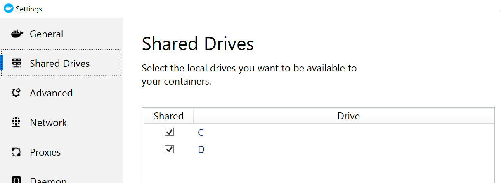

# Docker


**Only required for the node and algorithm development**

You only need to install Docker when you are installing a node or are planning to develop algorithms. Docker is **not** required for the client \(i.e. using VANTAGE6 to do research\), or if you are setting up a server. 


## Linux

VANTAGE6 has been successfully tested on Ubuntu, other Linux distributions will most likely also work. To install Docker, follow the instructions on their [website ](https://docs.docker.com/install/linux/linux-postinstall/)to install the engine. The lazy way would be to run the get-docker script:


Always verify scripts you download before executing them!




```bash
curl -fsSL https://get.docker.com -o get-docker.sh
sudo sh get-docker.sh
```



If you are logged in as non-root user \(which should be the case\), you need to add your username to the docker-group in order to run VANTAGE6 without root privileges. 



```bash
sudo groupadd docker
sudo usermod -aG docker $USER
```



First, logout and login again so that the group privileges are granted to your user. Then you can test it by executing docker commands without `sudo`:



```bash
docker run hello-world
```




If you run into issues, please check the Docker documentation


## MacOS 

The easiest way to install Docker on MacOS is installing Docker desktop, see these [instructions](https://docs.docker.com/docker-for-mac/install/). 



```text
docker run hello-world
```



## Windows

The easiest way to install Docker on Windows is installing Docker desktop, see these [instructions](https://docs.docker.com/docker-for-windows/install/). Make sure you select **Linux Containers** during the installation process. After installing the Docker engine needs access to the dataset location. Right click on the Docker icon and select settings:



Then go to Shared Drives and make sure the drive where the data is located is checked and press Apply.




```aspnet
docker run hello-world
```



