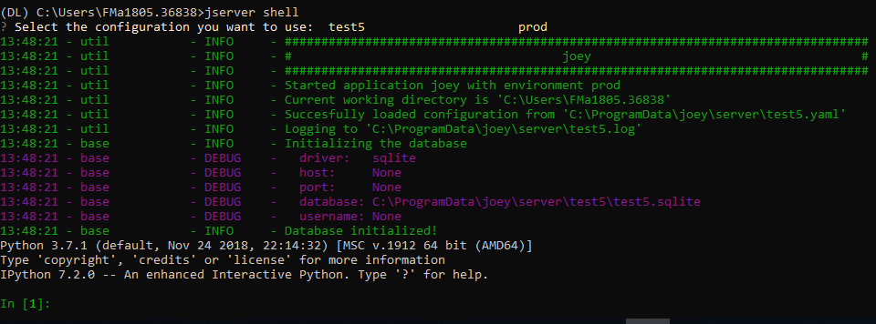

# Configuring the Server

It is assumed that the joey Python package has been successfully installed. If not, have a look at previous steps described in [Install VANTAGE6](install-vantage6.md).

## Using the Wizard 

The most straight forward way of creating a new server configuration is using the command `vserver new` which allows you to configure the most basic settings. 


By default the configuration-file is stored at system level, which makes this configuration available for all users. In case you want to use a user directory you can add the `--user` flag. 


To update a configuration you need to modify the created YAML file. To see where this file is located you can use the`vserver files` . Do not forget to specify the `--system` flag in the case of a system-wide configuration.


## Using a custom YAML file

The configuration wizard outputs a YAML file which can be loaded into joey. It is also possible to create this YAML file yourself, to see the stucture of this file please see out [github](https://github.com/IKNL/ppDLI/blob/master/pytaskmanager/_data/server_config_skeleton.yaml) or [Configuring the Server](untitled-1.md#configuration-file-structure). This file can be stored \(and refered to\) at any location at the machine, although it is recommended to use either the joey system or user folder. This folder is different for different operating systems. 

|  | System | User |
| :--- | :--- | :--- |
| Windows | C:\ProgramData\joey\server | C:\Users\&lt;user&gt;\AppData\Local\joey\server\ |
| MacOS |  |  |
| Linux |  |  |


Make sure that the uri is understood by SQLAlchemy, see [here](https://docs.sqlalchemy.org/en/latest/core/engines.html#database-urls) for more information.


## Starting the server

Once the configuration is done, you can start the server instance by using `vserver start` and then selecting the configuration you want to use.  Or if you already know the name of the configuration you can use the `--name` flag to specify it. If you have a configuration file which is in a non-default location than you can specify this by the `--config` flag. 


Note that having Docker installed is not strictly  necessary to run the server. However, it is needed if you want to run a private registry on the same machine. See \[\[Installation of Docker\]\] for details.


## Importing / Creating Entities

Now that the server has been started it is time to populate the server with **users**, **organizations**, **collaborations**, etc. Before you can manage these through the RESTful API interface \(which is the prevered way of doing this\) it is required that you create at least one organization with an admin user. 

It is possible to import multiple organizations, collaborations, etc. at the same time by using the command `vserver import [file]` . After which you will be asked to which server instance you want to add these entities \(or you can use the `--name` option to bypass this\). Another method of creating new entities is by starting an iPhyton session by using `vserver shell` in which you can directly use the python API. 

### Using Import

To see the structure of this YAML file please see our [github page](https://github.com/IKNL/ppDLI/blob/master/pytaskmanager/_data/example_fixtures.yaml). Once you have created this file containing your entities, you can import these by 

```bash
vserver import /path/to/your/file.yaml
```

### Using Shell

By using the shell you can access all database models which are stored in the variable `db` . Start the shell by running:

```bash
vserver shell
```

This will first start up the server, after which you will be able to use the iPython console. 



To add an user you first we first need an organization:

```python
organization = db.Organization(
    name="test",
    domain = "example.org",
    address = "Somestreet 3",
    zipcode = 1234,
    country = "Far away"
)
organization.save()
```

The `.save()` is required to store it in the database. Then we can assign a new user to this `organization` by:

```python
user = db.User(
    username="unique-username",
    firstname="John",
    lastname="Doe",
    roles=["admin"],
    organization=organization
)
user.set_password("Super-secret-password!")
user.save()
```

Note that we can not set the password direct, as it should be encrypted first. 

## Server Commands

In the section above we several times made use of the `vserver` command. The following sub-commands are available to manage the server\(s\). These commands can also be found by simply calling `vserver` .

| Command | Description |
| :--- | :--- |
| `vserver files` | List the file locations of the server instance |
| `vserver import` | Import server entities as a batch |
| `vserver list` | List the available server instances |
| `vserver new` | Create a new server configuration |
| `vserver shell` | Run a server instance python shell |
| `vserver start` | Start a server configuration |

## Configuration File Structure

Each server instance \(configuration\) can have multiple environments. If you do not want to specify any environment you should only specify the key `application` . In case you do want to use environments you can specify this in `environments` which allows four types: `dev` , `test`,`acc` and `prod` .  It should look like this:

```yaml
application:
  ...
environments:
  test:
    description: Test
    type: test
    ip: '127.0.0.1' 
    port: 5000  
    api_path: /api
    uri: sqlite:///test.sqlite
    allow_drop_all: True
    logging:
      level:        DEBUG                  
      file:         test.log              
      use_console:  True                   
      backup_count: 5                      
      max_size:     1024                   
      format:       "%(asctime)s - %(name)-14s - %(levelname)-8s - %(message)s"
      datefmt:      "%Y-%m-%d %H:%M:%S"

  prod:
    ...
```

## Logging

If logging to the console is enabled, starting the server or loading the fixtures should output some information that can be helpful in determining the cause of problems. For example, the output below shows:

* Which environment was used
* What configuration file was used
* Which database was used \(and its location\)

```text
################################################################################
#                                pytaskmanager                                 #
################################################################################
Started application 'pytaskmanager' with environment 'test'
Current working directory is '/home/melle'
Succesfully loaded configuration from '/home/melle/.config/pytaskmanager/server/default.yaml'
Logging to '/home/melle/.cache/pytaskmanager/log/server/default.log'
Initializing the database
  driver:   sqlite
  host:     None
  port:     None
  database: /home/melle/.local/share/pytaskmanager/server/default/test.sqlite
  username: None
Database initialized!
```

