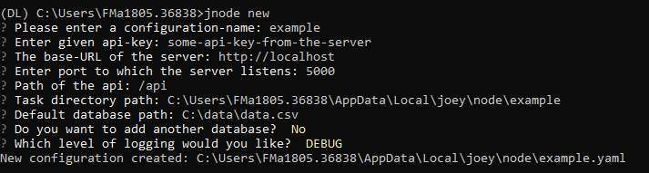

# Configuring the Node


At this moment the docker image which contains the node needs to be pulled manually: `docker pull harbor.distributedlearning.ai/infrastructure/node`


It is assumed that Docker and the Vantage Python package have been successfully installed. If not, have a look at previous steps described in [Installation of Docker](install-docker.md) and [Install Vantage](install-vantage6.md).


A data-provider needs a node for each of the collaboration it participates in.


## Using the Wizard

The most straight forward way of creating a new server configuration is using the command `vnode new` which allows you to configure the most basic settings. 



By default the node configuration file is stored at user level, which isolates this configuration from other users. In case you want this configuration to be available for all users, simply add the `--system` flag.


To update a configuration you need to modify the created YAML file. To see where this file is located you can use `vnode files` . Do not forget to specify the `--system` flag in the case of a system-wide configuration.


## Using a Custom YAML File

The configuration wizard outputs a YAML file which can be loaded into Joey. It is also possible to create this file yourself, to see [Configuration File Structure](untitled-2.md#configuration-file-structure) or an example on our [github](https://github.com/iknl/ppdli) page. This file can be stored \(and referred to\) at any location at the machine, although it recommended to use either the Joey system or user folder. These folders are different per operating system.

| Operating System | System-folder | User-folder |
| :--- | :--- | :--- |
| Windows | C:\ProgramData\joey\node | C:\Users\&lt;user&gt;\AppData\Local\vantage\node |
| MacOS |  |  |
| Linux |  | /home/&lt;user&gt;/.config/vantage/node/ |


To start a node using a configuration file at an arbitrary location you should use the config option:`vnode start --config /path/to/config.yaml` note that this will overwrite all other options.


##  Starting the Node

Once a configuration is created you can start this instance by using `vnode start` and select the configuration you wish to start. Or in the case you already know the name of the configuration you can use `vnode start --name [config_name]` . It is also possible to use a configuration file that is in a non-default location by using `vnode start --config /path/to/config` . All other options will be overwritten when using this option.


Node configurations are assumed to be in the user-folder. However if you have a configuration stored in the system-folder you should add the flag system: `vnode start --system` .


## Node Commands

In the section above we used the`vnode` command several times. All sub-commands can be found by simply running `vnode` , which will display the following list:

| Command | Description |
| :--- | :--- |
| `vnode new` | Create a new configuration file |
| `vnode list` | List all available configurations \(both system/user\) |
| `vnode files` | List file locations of the node instance |
| `vnode start` | Start a node configuration |

## Configuration File Structure

Each node instance \(configuration\) can have multiple environments. If you do not want to specify any environment you should only specify the `application` key. In the case you do want to use environments you can specify this in `environments` which allows up to four environments: `dev`, `test`,`acc`, and `prod` . It should have the following structure:

```yaml
application:
  api_key: api-key-from-server
  server_url: https://api.distributedlearning.ai
  port: 5000
  api_path: '/api'
  task_dir: tasks
  encryption:
    private_key: /path/to/private_key.pem
  databases:
    default: 

  logging:
      level:        DEBUG             # Can be on of 'DEBUG', 'INFO', 'WARNING', 'ERROR', 'CRITICAL'
      file:         node.log          # Filename of logfile
      use_console:  True              # Log output to the console?
      backup_count: 5                 # Number of logs to keep
      max_size:     1024              # Specified in kB (i.e. 1024 means a maximum file size of 1MB)
      format:       "%(asctime)s - %(name)-14s - %(levelname)-8s - %(message)s"
      datefmt:      "%H:%M:%S"
```

##  

