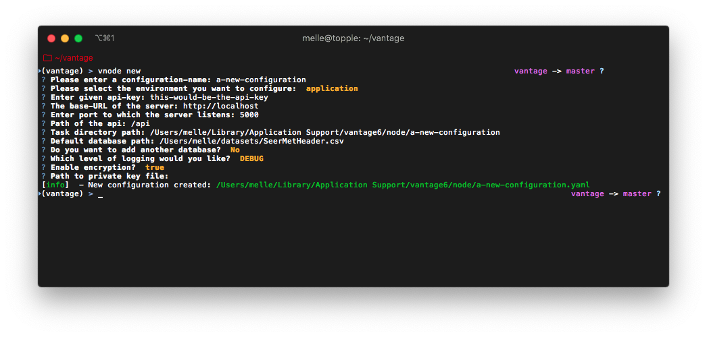

# Configuration

## Options

Configuration of the server can be done either through the command line or by creating a custom YAML configuration file. Both options will be detailed below.

## 🧙 Configure using the Wizard

The most straight forward way of creating a new server configuration is using the command `vnode new` which allows you to configure the most basic settings.



By default the node configuration file is stored at user level, which isolates this configuration from other users. In case you want this configuration to be available for all users, simply add the `--system` flag \(make sure you have sufficient rights to do this\).


To update a configuration you need to modify the created YAML file. To see where this file is located you can use the command `vnode files` . Do not forget to specify the `--system` flag in the case of a system-wide configuration.


## 👩🔬 Configure using a custom YAML file

The configuration wizard outputs a YAML file which can be loaded into VANTAGE6. It is also possible to create this file yourself, to see [Configuration File Structure](./#configuration-file-structure) or an example on our [github](https://github.com/iknl/ppdli) page. This file can be stored \(and referred to\) at any location at the machine, although it recommended to use either the VANTAGE6 system or user folder. These folders are different per operating system.

| Operating System | System-folder | User-folder |
| :--- | :--- | :--- |
| Windows | C:\ProgramData\vantage\node | C:\Users\&lt;user&gt;\AppData\Local\vantage\node |
| MacOS | /Library/Application Support/vantage6/node | /Users/&lt;user&gt;/Library/Application Support/vantage6/node |
| Linux | /etc/vantage/node | /home/&lt;user&gt;/.config/vantage/node |


To start a node using a configuration file at an arbitrary location you should use the config option:`vnode start --config /path/to/config.yaml` note that this will overwrite all other options.


## 🗃 Configuration File Structure

Similar to the server, each node instance \(configuration\) can have multiple environments. You can specify these under the key `environments` which allows four types: `dev` , `test`,`acc` and `prod` .


We use [DTAP for key environments](https://en.wikipedia.org/wiki/Development,_testing,_acceptance_and_production). In short:

* `dev` Development environment. It is ok to break things here
* `test` Testing environment. Here, you can verify that everything works as expected. This environment should resemble as much as possible the target environment where the final solution will be deployed.
* `acc` Acceptance environment. If the tests were successful, you can try this environment, where the final user will test  his/her analysis to verify if everything meets his/her expectations.
* `prod` Production environment. Final version of the proposed solution.


If you do not want to specify any environment, you should only specify the key `application` .

In the end, the configuration file should have the following structure:

```yaml
application:
  api_key: api-key-from-server
  server_url: https://api.distributedlearning.ai
  port: 5000
  api_path: '/api'
  task_dir: tasks
  encryption:
    enabled: true
    private_key: /path/to/private_key.pem
  docker_registries:
    - registry: harbor.vantage6.ai
      username: docker-registry-user
      password: your-password!
  allowed_images:
    - ^harbor.vantage6.ai/[a-zA-Z]+/[a-zA-Z]+
  databases:
    default: /path/to/database.csv
    alternative: /path/to/other/database.csv
  logging:
      level:        DEBUG             # Can be on of 'DEBUG', 'INFO', 'WARNING', 'ERROR', 'CRITICAL'
      file:         node.log          # Filename of logfile
      use_console:  True              # Log output to the console?
      backup_count: 5                 # Number of logs to keep
      max_size:     1024              # Specified in kB (i.e. 1024 means a maximum file size of 1MB)
      format:       "%(asctime)s - %(name)-14s - %(levelname)-8s - %(message)s"
      datefmt:      "%H:%M:%S"
```

## 📰 Parameter description

| Parameter | Details |
| :--- | :--- |
| `api_key` | API key used to authenticate at the server. |
| `server_url` | URL of the vantage6 server. |
| `port` | Port of the vantage6 server. Should be `443` in most cases. |
| `api_path` | Path of the API. Usually empty or `/api`. |
| `task_dir` | Local task directory name |
| `encryption` | Section that contains encryption settings:  `enabled`: Boolean to indicate whenever encryption is used or not. `private_key`: path to private key file.  See [here](configuration.md#encryption) for more details. |
| `docker_registries` | Section that contains  a list Docker registry login credentials: `registry`: url of the docker registry `username`: username `password`: password See [here](configuration.md#docker-login) for more detail. |
| `allowed_images` | List of [regular expressions](https://en.wikipedia.org/wiki/Regular_expression) that control which algorithms are allowed on this node. See [here](configuration.md#allowed-images) for more detail. |
| `databases` | List of databases in `key`:`value` pair \(💔 broken in current version. Will be fixed in a future release, only the default database can be used.\) |
| `logging` |  `file`: filename of the log-file, used by [RotatingFileHandler](https://docs.python.org/3/library/logging.handlers.html#logging.handlers.RotatingFileHandler) `backup_count`: the number of log files that are kept, used by [RotatingFileHandler](https://docs.python.org/3/library/logging.handlers.html#logging.handlers.RotatingFileHandler) `max_size`: size kb of a single log file, used by [RotatingFileHandler](https://docs.python.org/3/library/logging.handlers.html#logging.handlers.RotatingFileHandler) `format`: input for `logging.Formatter`, see [here](https://docs.python.org/3/library/logging.html#logging.Formatter). `level`: debug level used, see [here](https://docs.python.org/3/library/logging.html#logging-levels). `use_console`: whenever the output needs to be shown in the console |

### 🔒 Encryption

Both the server and node need to agree if encryption is used or not. Encryption at the server is managed at collaboration level, i.e. each collaboration determines whenever encryption of all communication is used or not. You can enable or disable encryption in the configuration file by setting the `enabled` key in the encryption section.

```yaml
application:
  ...
  encryption:
    enabled: true
    private_key: /path/to/private_key.pem
  ...
```

To generate a new private key and upload the public key to the server you can use the command `vnode create-private-key`. You can also generate the key yourself and upload it by using the `/organization/<id>` endpoint.


Note that public keys are managed at organization level, meaning that you only can use one private key for all your nodes. It is not possible \(yet\) to create an unique private key for each node you own.


### 🏳 Allowed Images

To control which algorithms are allowed at the node you can set the `allowed_images` key in the configuration file. This is expected to be a valid [regular expression](https://en.wikipedia.org/wiki/Regular_expression).

```yaml
application:
  ...
  allowed_images:
    - ^harbor.vantage6.ai/[a-zA-Z]+/[a-zA-Z]+
  ...
```

### 🐳 Docker Login

If you are using a private docker repository the environment in which the node needs to be logged in to that repository. In case the Dockerized version of vantage6 is used you need to specify this in the configuration file using the `docker_registries` key.

```yaml
application:
  ...
  docker_registries:
    - registry: harbor.vantage6.ai
      username: docker-registry-user
      password: your-password!
  ...
```
