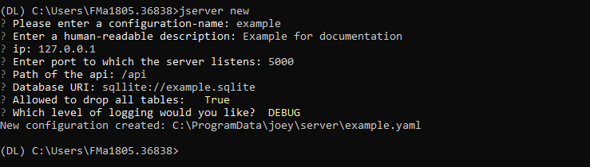

# Configuration

## Preliminaries

It is assumed that the Python package `vantage6` has been successfully installed \(see [Dockerized installation](../../installation/dockerized-installation.md) if necessary\). 

## Options

Configuration of the server can be done either through the command line or by creating a custom YAML configuration file. Both options will be detailed below.


Make sure that the database URI is understood by SQLAlchemy. See [here](https://docs.sqlalchemy.org/en/latest/core/engines.html#database-urls) for more information.


### 🧙♂ Configure Using the Wizard 

The most straight forward way of creating a new server configuration is using the command `vantage6 server new` in python which allows you to configure the most basic settings.  See the image below to get an overview of what happens.



By default the configuration-file is stored at system level, which makes this configuration available for _all_ users. In case you want to use a user directory you can add the `--user` flag. 

To update a configuration you need to modify the created YAML file. To see where this file is located you can use thevserver files . Do not forget to specify the --system flag in the case of a system-wide configuration.

To update the configuration you need to modify the previously created YAML file. To see where this file is located you can use the`vserver files` . Do not forget to specify the `--user` flag in case of a user-level configuration.

### 👩🔬 Configure Using a custom YAML file

The configuration wizard outputs a YAML file that can be used by the server. It is also possible to create this YAML file by hand. An example of the structure of this file is shown [below](server-configuration.md#configuration-file-structure). 

While it's technically possible to store the configuration files anywhere on your machine, it is _highly_ recommended to use the default **vantage6** system \(or user\) folder; this is done automatically if you use the [wizard](server-configuration.md#configure-using-the-wizard). The location of this folder depends on the operating system used \(see the table below\).

| OS | System | User |
| :--- | :--- | :--- |
| Windows | C:\ProgramData\vantage\server | C:\Users\&lt;user&gt;\AppData\Local\vantage\server\ |
| MacOS | /Library/Application Support/vantage/server/ | /Users/&lt;user&gt;/Library/Application Support/vantage/server/ |
| Ubuntu | /etc/xdg/vantage/server/ | ~/.config/vantage/server/ |

### 🗃 Configuration File Structure

Each server instance \(configuration\) can have multiple environments. If you do not want to specify any environment you should only specify the key `application` . In case you do want to use environments you can specify these under the key `environments` which allows four types: `dev` , `test`,`acc` and `prod` .  It should look like this:

```yaml
application:
  ...
environments:
  test:
    description: Test
    type: test
    ip: '127.0.0.1' 
    port: 5000  
    api_path: /api
    uri: sqlite:///test.sqlite
    allow_drop_all: True
    jwt_secret_key: super-secret-key! #recommended but optional
    logging:
      level:        DEBUG                  
      file:         test.log              
      use_console:  True                   
      backup_count: 5                      
      max_size:     1024                   
      format:       "%(asctime)s - %(name)-14s - %(levelname)-8s - %(message)s"
      datefmt:      "%Y-%m-%d %H:%M:%S"

  prod:
    ...
```

## ✍ Logging

If logging to the console is enabled, starting the server or loading the fixtures outputs some information that can be helpful in determining the cause of problems. For example, the output below shows:

* Which environment was used
* What configuration file was used
* Which database was used

```bash
################################################################################
#                                   vantage                                    #
################################################################################
Started application vantage with environment prod
Current working directory is '/root'
Succesfully loaded configuration from '/etc/xdg/vantage/server/example.yaml'
Logging to '/usr/local/share/vantage/server/example.log'
Initializing the database
  driver:   sqlite
  host:     None
  port:     None
  database: /usr/local/share/vantage/server/example/example.sqlite
  username: None
Database initialized!
```

