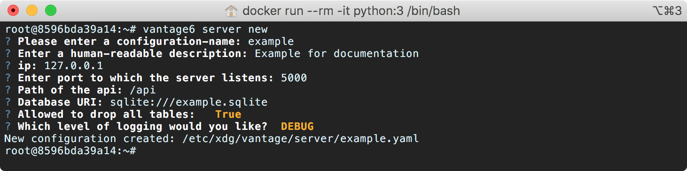

# Configuration

## Preliminaries

It is assumed that the Python package `vantage6` has been successfully installed \(see [Dockerized installation](../../installation/dockerized-installation.md) if necessary\). 

## Options

Configuration of the server can be done either through the command line or by creating a custom YAML configuration file. Both options will be detailed below.


Make sure that the database URI is understood by SQLAlchemy. See [here](https://docs.sqlalchemy.org/en/latest/core/engines.html#database-urls) for more information.


### 🧙♂ Configuration Using the Wizard 

The most straight forward way of creating a new server configuration is using the command `vserver new` in Python which allows you to configure the most basic settings.  See the image below to get an overview of what happens.



By default the `configuration-file` is stored at system level, which makes this configuration available for _all_ users. In case you want to use a user directory you can add the `--user` flag. 

To update a configuration you need to modify the created YAML file. To see where this file is located you can use the command `vserver files` . Do not forget to specify the flag `--system` in the case of a system-wide configuration or the flag `--user` in case of a user-level configuration.

### 👩🔬 Configuration Using a Custom YAML File

The configuration wizard outputs a YAML file that can be used by the server. It is also possible to create this YAML file by hand. An example of the structure of this file is shown [below](server-configuration.md#configuration-file-structure). 

While it's technically possible to store the configuration files anywhere on your machine, it is _highly_ recommended to use the default **vantage6** system \(or user\) folder; this is done automatically if you use the [wizard](server-configuration.md#configure-using-the-wizard). The location of this folder depends on the operating system used \(see the table below\).

| OS | System | User |
| :--- | :--- | :--- |
| Windows | `C:\ProgramData\vantage\server` | `C:\Users\<user>\AppData\Local\vantage\server\` |
| MacOS | `/Library/Application Support/vantage/server/` | `/Users/<user>/Library/Application Support/vantage/server/` |
| Ubuntu | `/etc/xdg/vantage/server/` | `~/.config/vantage/server/` |

### 🗃 Configuration File Structure

Each server instance \(configuration\) can have multiple environments. You can specify these under the key `environments` which allows four types: `dev` , `test`,`acc` and `prod` .  


We use [DTAP for key environments](https://en.wikipedia.org/wiki/Development,_testing,_acceptance_and_production). In short:

* `dev` Development environment. It is ok to break things here
* `test` Testing environment. Here, you can verify that everything works as expected. This environment should resemble as much as possible the target environment where the final solution will be deployed.
* `acc` Acceptance environment. If the tests were successful, you can try this environment, where the final user will test  his/her analysis to verify if everything meets his/her expectations.
* `prod` Production environment. Final version of the proposed solution.


If you do not want to specify any environment, you should only specify the key `application` .

In the end, the configuration file should look like this:

```yaml
application:
  ...
environments:
  test:
    description: Test
    type: test
    ip: '127.0.0.1' 
    port: 5000  
    api_path: /api
    uri: sqlite:///test.sqlite
    allow_drop_all: True
    jwt_secret_key: super-secret-key! #recommended but optional
    logging:
      level:        DEBUG                  
      file:         test.log              
      use_console:  True                   
      backup_count: 5                      
      max_size:     1024                   
      format:       "%(asctime)s - %(name)-14s - %(levelname)-8s - %(message)s"
      datefmt:      "%Y-%m-%d %H:%M:%S"

  prod:
    ...
```

