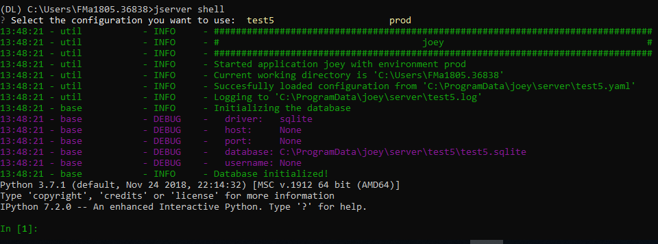

# iPython Shell

## 👨💻 Starting the Shell Interface

Similar to the command `vserver start` an administrator can start an _iPython_ shell to manage all entities at the server. The preferred method of managing entities is using the API, instead of the Shell interface. This is because the API will perform check, whereas in the case of the Shell all inputs are accepted. 

Start the Shell interface using:



```bash
vserver shell [options]
```



You should see something resembling the following:



## General

## 🏢Organizations

To create an organization you can use the `db.Organization` model:



```python
# create new organiztion
organization = db.Organization(
    name="IKNL",
    domain="iknl.nl",
    address1="Zernikestraat 29",
    address2="Eindhoven",
    zipcode="5612HZ",
    country="Netherlands"
)

# Note: organizations have a public key that is used for end-to-end
# encryption. This key is automatically created by the Node the 
# first time it's run.
# TODO: key generation will change in an upcoming release.

# store organization in the database
organization.save()
```



Retrieving organizations from the database:



```python
# get all organizations in the database
organizations = db.Organization.get()

# get organization by its unique id
organization = db.Organization.get(1)

# get organization by its name
organization = db.Organization.get_by_name("IKNL")
```



A lot of entities at the server are connected to an organization. For example you can see which \(computation\) tasks are issued by the organization or see which collaborations it is participating within.



```python
# retrieve organization from which we want to know more
organization = db.Organization.get_by_name("IKNL")

# get all collaborations in which the organization participates
collaborations = organization.collaborations

# get all users from the organization
users = organization.users

# get all created tasks (from all users)
tasks = organization.created_tasks

# get the results of all these tasks
results = organization.results

# get all nodes of this organization (for each collaboration
# an organization participates in, it needs a node)
nodes = organization.nodes
```



## 👩🏭 Users

Users \(always\) belong to an organization. So if you have not created an organization as of yet, then this should be your first step. To create a user you can use the `db.User` model:



```python
# first otain the organization to which the new user belongs
org = db.Organization.get_by_name("IKNL")

# create the new users
new_user = db.User(
    username="root",
    password="super-secret",
    firstname="John", 
    lastname="Doe", 
    roles="root",
    organization=org
)

# store the user in the database
new_user.save()
```



You can retrieve users in the following ways:



```python
# get all users
db.User.get()

# get user by its unique id
db.User.get(1)

# get user by username
db.User.getByUsername("root")

# get all users from the organization IKNL
db.Organization.get_by_name("IKNL").users
```



To modify a user, simply adjust the properties and save the object.



```python
user = db.User.getByUsername("some-existing-username")

# update the firstname
user.firstname = "Brandnew"

# update the password; it is automatically hashed.
user.password = "something-new"

# store the updated user in the database
user.save()
```



## 🤲 Collaborations

A collaboration consists of one or more organizations. 

To create a collaboration you need at least one organization in your database \(look [here](shell.md#organizations) how to add an organization\). To create a collaboration you can use the `db.Collaboration` model:



```python
# create a second organization to collaborate with
other_organization = db.Organization(
    name="IKNL",
    domain="iknl.nl",
    address1="Zernikestraat 29",
    address2="Eindhoven",
    zipcode="5612HZ",
    country="Netherlands"
)
other_organization.save()

# get organization we have created earlier
iknl = db.Organization.get_by_name("IKNL")

# create the collaboration
collaboration = db.Collaboration(
    name="collaboration-name", 
    encrypted=False,
    organizations=[iknl, other_organization]
)

# store the collaboration in the database
collaboration.save()
```



Tasks, nodes and organizations are directly related to collaborations. We can obtain these:



```python
# obtain a collaboration which we like to inspect
collaboration = db.Collaboration.get(1)

# get all nodes
collaboration.nodes

# get all tasks issued for this collaboration
collaboration.tasks

# get all organizations
collaboration.organizations
```




Setting the encryption to false at the server does not mean that the nodes will send encrypted results. This is only the case if the nodes also agree on this setting.


## 🚉 Nodes

Before nodes can login, they need to exist in the server's database. A new node can be created as follows:



```python
# We'll use a uuid as the API-key
from uuid import uuid1

# Nodes always belong to an organization *and* a collaboration
iknl = db.Organization.get_by_name("IKNL")
collab = iknl.collaborations[0]

node = db.Node(
    name = f"IKNL Node - Collaboration {collab.name}",
    organization = iknl,
    collaboration = collab,
    api_key = str(uuid1())
)

# Save the new node to the database
node.save()

# Print / save the API-key, so it can be put in the node's
# config file. Keep this key secret!
print(node.api_key)
```







## 📔 Tasks

All computation requests are stored as tasks at the server. A task can be intended for multiple organizations \(and thereby also for multiple nodes\). In case you want to create a task from the shell you can use the `db.Task` model. Note that the task will not be picked up by nodes. Only tasks posted to the API will be picked up by nodes, as then they receive a message through the web-socket interface and corresponding `db.Result` records are created.



```python
# obtain organization from which this task is posted 
iknl = db.Organization.get_by_name("IKNL")

# obtain collaboration for which we want to create a task
collaboration = db.Collaboration.get(1)

# obtain the next run_id. Tasks sharing the same run_id
# can share the temporary volumes at the nodes. Usually this 
# run_id is assigned through the API (as the user is not allowed 
# to do so). All tasks from a master-container share the 
# same run_id
run_id = db.Task.next_run_id()

task = db.Task(
    name="some-name",
    description="some human readable description",
    image="some-docker-registry.domain.org/image-name",
    collaboration=collaboration,
    run_id=run_id,
    database="default",
    initiator=iknl,
)
task.save()
```



Obtaining results:



```python
# get all tasks
db.Task.get()

# get task by its unique id
db.Task.get(1)

# get tasks which are complete. A task is complete
# if all nodes have returned a result
[task for task in db.Task.get() if task.complete]
```



Tasks can have a child/parent relationship. In case a master container posts a task, the parent task would be the task that created the master container itself. Also the `run_id` is for parent and child tasks the same.



```python
# get a task to which we want to create some
# child tasks
parent_task = db.Task.get(1)

child_task = db.Task(
    name="some-name",
    description="some human readable description",
    image="some-docker-registry.domain.org/image-name",
    collaboration=collaboration,
    run_id=parent_task.run_id,
    database="default",
    initiator=iknl,
    parent=parent_task
)
child_task.save()
```



## 📈 Results

A task has one or more results, depending on the number of organization for which the task is intended. For each organization a result record is made. The `db.Result` model also contains the input specifically encrypted for the organization that has to execute the task. To create a result you need a `db.Task` first.

```bash
task = db.Task.get(1)

```

Obtaining results:



```python
# obtain all Results
db.Result.get()

# obtain only completed results
[result for result in db.Result.get() if result.complete]

# obtain result by its unique id
db.Result.get(1)
```



